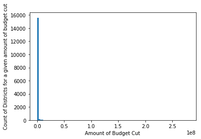

### Problem 1

Following is the district-level fiscal data from 2015-16. 


<div>

<table border="1" class="dataframe">
  <thead>
    <tr style="text-align: right;">
      <th></th>
      <th>LEAID</th>
      <th>CENSUSID</th>
      <th>FIPST</th>
      <th>CONUM</th>
      <th>CSA</th>
      <th>CBSA</th>
      <th>NAME</th>
      <th>STNAME</th>
      <th>STABBR</th>
      <th>SCHLEV</th>
      <th>...</th>
      <th>FL_61V</th>
      <th>FL_66V</th>
      <th>FL_W01</th>
      <th>FL_W31</th>
      <th>FL_W61</th>
      <th>FL_V95</th>
      <th>FL_V02</th>
      <th>FL_K14</th>
      <th>FL_CE1</th>
      <th>FL_CE2</th>
    </tr>
  </thead>
  <tbody>
    <tr>
      <th>0</th>
      <td>100002</td>
      <td>N</td>
      <td>1</td>
      <td>01073</td>
      <td>142</td>
      <td>13820</td>
      <td>Alabama Youth Services</td>
      <td>Alabama</td>
      <td>AL</td>
      <td>N</td>
      <td>...</td>
      <td>M</td>
      <td>M</td>
      <td>M</td>
      <td>M</td>
      <td>M</td>
      <td>M</td>
      <td>M</td>
      <td>M</td>
      <td>M</td>
      <td>M</td>
    </tr>
    <tr>
      <th>1</th>
      <td>100005</td>
      <td>01504840100000</td>
      <td>1</td>
      <td>01095</td>
      <td>290</td>
      <td>10700</td>
      <td>Albertville City</td>
      <td>Alabama</td>
      <td>AL</td>
      <td>03</td>
      <td>...</td>
      <td>M</td>
      <td>M</td>
      <td>R</td>
      <td>R</td>
      <td>R</td>
      <td>M</td>
      <td>M</td>
      <td>M</td>
      <td>M</td>
      <td>M</td>
    </tr>
    <tr>
      <th>2</th>
      <td>100006</td>
      <td>01504800100000</td>
      <td>1</td>
      <td>01095</td>
      <td>290</td>
      <td>10700</td>
      <td>Marshall County</td>
      <td>Alabama</td>
      <td>AL</td>
      <td>03</td>
      <td>...</td>
      <td>M</td>
      <td>M</td>
      <td>R</td>
      <td>R</td>
      <td>R</td>
      <td>M</td>
      <td>M</td>
      <td>M</td>
      <td>M</td>
      <td>M</td>
    </tr>
    <tr>
      <th>3</th>
      <td>100007</td>
      <td>01503740100000</td>
      <td>1</td>
      <td>01073</td>
      <td>142</td>
      <td>13820</td>
      <td>Hoover City</td>
      <td>Alabama</td>
      <td>AL</td>
      <td>03</td>
      <td>...</td>
      <td>M</td>
      <td>M</td>
      <td>R</td>
      <td>R</td>
      <td>R</td>
      <td>M</td>
      <td>M</td>
      <td>M</td>
      <td>M</td>
      <td>M</td>
    </tr>
    <tr>
      <th>4</th>
      <td>100008</td>
      <td>01504530100000</td>
      <td>1</td>
      <td>01089</td>
      <td>290</td>
      <td>26620</td>
      <td>Madison City</td>
      <td>Alabama</td>
      <td>AL</td>
      <td>03</td>
      <td>...</td>
      <td>M</td>
      <td>M</td>
      <td>R</td>
      <td>R</td>
      <td>R</td>
      <td>M</td>
      <td>M</td>
      <td>M</td>
      <td>M</td>
      <td>M</td>
    </tr>
    <tr>
      <th>...</th>
      <td>...</td>
      <td>...</td>
      <td>...</td>
      <td>...</td>
      <td>...</td>
      <td>...</td>
      <td>...</td>
      <td>...</td>
      <td>...</td>
      <td>...</td>
      <td>...</td>
      <td>...</td>
      <td>...</td>
      <td>...</td>
      <td>...</td>
      <td>...</td>
      <td>...</td>
      <td>...</td>
      <td>...</td>
      <td>...</td>
      <td>...</td>
    </tr>
    <tr>
      <th>18703</th>
      <td>5680250</td>
      <td>51502040100000</td>
      <td>56</td>
      <td>56039</td>
      <td>N</td>
      <td>27220</td>
      <td>Region V BOCES</td>
      <td>Wyoming</td>
      <td>WY</td>
      <td>07</td>
      <td>...</td>
      <td>N</td>
      <td>N</td>
      <td>N</td>
      <td>N</td>
      <td>N</td>
      <td>N</td>
      <td>N</td>
      <td>N</td>
      <td>N</td>
      <td>N</td>
    </tr>
    <tr>
      <th>18704</th>
      <td>5680251</td>
      <td>N</td>
      <td>56</td>
      <td>56021</td>
      <td>N</td>
      <td>16940</td>
      <td>Wyoming Department of Family Services</td>
      <td>Wyoming</td>
      <td>WY</td>
      <td>N</td>
      <td>...</td>
      <td>N</td>
      <td>N</td>
      <td>N</td>
      <td>N</td>
      <td>N</td>
      <td>N</td>
      <td>N</td>
      <td>N</td>
      <td>N</td>
      <td>N</td>
    </tr>
    <tr>
      <th>18705</th>
      <td>5680252</td>
      <td>N</td>
      <td>56</td>
      <td>56005</td>
      <td>N</td>
      <td>23940</td>
      <td>Youth Emergency Services Inc. - Administration...</td>
      <td>Wyoming</td>
      <td>WY</td>
      <td>N</td>
      <td>...</td>
      <td>N</td>
      <td>N</td>
      <td>N</td>
      <td>N</td>
      <td>N</td>
      <td>N</td>
      <td>N</td>
      <td>N</td>
      <td>N</td>
      <td>N</td>
    </tr>
    <tr>
      <th>18706</th>
      <td>5680253</td>
      <td>N</td>
      <td>56</td>
      <td>56025</td>
      <td>N</td>
      <td>16220</td>
      <td>Wyoming Behavioral Institute - Administration ...</td>
      <td>Wyoming</td>
      <td>WY</td>
      <td>N</td>
      <td>...</td>
      <td>N</td>
      <td>N</td>
      <td>N</td>
      <td>N</td>
      <td>N</td>
      <td>N</td>
      <td>N</td>
      <td>N</td>
      <td>N</td>
      <td>N</td>
    </tr>
    <tr>
      <th>18707</th>
      <td>5680254</td>
      <td>N</td>
      <td>56</td>
      <td>56013</td>
      <td>N</td>
      <td>40180</td>
      <td>Saint Stephen's Indian School Admin Office</td>
      <td>Wyoming</td>
      <td>WY</td>
      <td>03</td>
      <td>...</td>
      <td>N</td>
      <td>N</td>
      <td>N</td>
      <td>N</td>
      <td>N</td>
      <td>N</td>
      <td>N</td>
      <td>N</td>
      <td>N</td>
      <td>N</td>
    </tr>
  </tbody>
</table>
<p>18708 rows × 260 columns</p>
</div>


#### It seems like the federal funding (revenue) follows a power log distribution, with a few schools recieving most of the federal fundings.


<div>

<table border="1" class="dataframe">
  <thead>
    <tr style="text-align: right;">
      <th></th>
      <th>Revenue</th>
    </tr>
    <tr>
      <th>STNAME</th>
      <th></th>
    </tr>
  </thead>
  <tbody>
    <tr>
      <th>California</th>
      <td>7709274795</td>
    </tr>
    <tr>
      <th>Texas</th>
      <td>6194316950</td>
    </tr>
    <tr>
      <th>New York</th>
      <td>3374793578</td>
    </tr>
    <tr>
      <th>Florida</th>
      <td>3147328988</td>
    </tr>
    <tr>
      <th>Illinois</th>
      <td>2334944853</td>
    </tr>
    <tr>
      <th>Pennsylvania</th>
      <td>2037314939</td>
    </tr>
    <tr>
      <th>Ohio</th>
      <td>1837962930</td>
    </tr>
    <tr>
      <th>Georgia</th>
      <td>1815241986</td>
    </tr>
    <tr>
      <th>Michigan</th>
      <td>1731033937</td>
    </tr>
    <tr>
      <th>North Carolina</th>
      <td>1587975932</td>
    </tr>
    <tr>
      <th>Arizona</th>
      <td>1302009922</td>
    </tr>
    <tr>
      <th>New Jersey</th>
      <td>1249740990</td>
    </tr>
    <tr>
      <th>Louisiana</th>
      <td>1115618894</td>
    </tr>
    <tr>
      <th>Washington</th>
      <td>1098331976</td>
    </tr>
    <tr>
      <th>Tennessee</th>
      <td>1096181996</td>
    </tr>
    <tr>
      <th>Virginia</th>
      <td>1058145818</td>
    </tr>
    <tr>
      <th>Indiana</th>
      <td>1015475961</td>
    </tr>
    <tr>
      <th>Missouri</th>
      <td>959977972</td>
    </tr>
    <tr>
      <th>Kentucky</th>
      <td>880295974</td>
    </tr>
    <tr>
      <th>South Carolina</th>
      <td>860866990</td>
    </tr>
    <tr>
      <th>Maryland</th>
      <td>823598998</td>
    </tr>
    <tr>
      <th>Massachusetts</th>
      <td>804594987</td>
    </tr>
    <tr>
      <th>Alabama</th>
      <td>803906916</td>
    </tr>
    <tr>
      <th>Wisconsin</th>
      <td>782646932</td>
    </tr>
    <tr>
      <th>Colorado</th>
      <td>721718867</td>
    </tr>
    <tr>
      <th>Oklahoma</th>
      <td>703224894</td>
    </tr>
    <tr>
      <th>Mississippi</th>
      <td>690723968</td>
    </tr>
    <tr>
      <th>Minnesota</th>
      <td>685054951</td>
    </tr>
    <tr>
      <th>Arkansas</th>
      <td>606945973</td>
    </tr>
    <tr>
      <th>Oregon</th>
      <td>582559990</td>
    </tr>
    <tr>
      <th>New Mexico</th>
      <td>516288985</td>
    </tr>
    <tr>
      <th>Connecticut</th>
      <td>484185984</td>
    </tr>
    <tr>
      <th>Iowa</th>
      <td>464851996</td>
    </tr>
    <tr>
      <th>Kansas</th>
      <td>453921959</td>
    </tr>
    <tr>
      <th>Utah</th>
      <td>419641976</td>
    </tr>
    <tr>
      <th>Nevada</th>
      <td>405789000</td>
    </tr>
    <tr>
      <th>West Virginia</th>
      <td>360283000</td>
    </tr>
    <tr>
      <th>Nebraska</th>
      <td>346825973</td>
    </tr>
    <tr>
      <th>Alaska</th>
      <td>307320000</td>
    </tr>
    <tr>
      <th>Hawaii</th>
      <td>261131000</td>
    </tr>
    <tr>
      <th>Idaho</th>
      <td>248545991</td>
    </tr>
    <tr>
      <th>District of Columbia</th>
      <td>226201985</td>
    </tr>
    <tr>
      <th>Montana</th>
      <td>220339869</td>
    </tr>
    <tr>
      <th>South Dakota</th>
      <td>196643958</td>
    </tr>
    <tr>
      <th>Rhode Island</th>
      <td>188203996</td>
    </tr>
    <tr>
      <th>Maine</th>
      <td>186522987</td>
    </tr>
    <tr>
      <th>New Hampshire</th>
      <td>169165780</td>
    </tr>
    <tr>
      <th>North Dakota</th>
      <td>155452961</td>
    </tr>
    <tr>
      <th>Delaware</th>
      <td>144706995</td>
    </tr>
    <tr>
      <th>Wyoming</th>
      <td>123011974</td>
    </tr>
    <tr>
      <th>Vermont</th>
      <td>111890912</td>
    </tr>
  </tbody>
</table>
</div>


    <matplotlib.axes._subplots.AxesSubplot at 0x7f5915655588>


### Problem 2


<div>

<table border="1" class="dataframe">
  <thead>
    <tr style="text-align: right;">
      <th></th>
      <th>LEAID</th>
      <th>CENSUSID</th>
      <th>FIPST</th>
      <th>CONUM</th>
      <th>CSA</th>
      <th>CBSA</th>
      <th>NAME</th>
      <th>STNAME</th>
      <th>STABBR</th>
      <th>SCHLEV</th>
      <th>...</th>
      <th>FL_61V</th>
      <th>FL_66V</th>
      <th>FL_W01</th>
      <th>FL_W31</th>
      <th>FL_W61</th>
      <th>FL_V95</th>
      <th>FL_V02</th>
      <th>FL_K14</th>
      <th>FL_CE1</th>
      <th>FL_CE2</th>
    </tr>
  </thead>
  <tbody>
    <tr>
      <th>0</th>
      <td>100002</td>
      <td>N</td>
      <td>1</td>
      <td>01073</td>
      <td>142</td>
      <td>13820</td>
      <td>Alabama Youth Services</td>
      <td>Alabama</td>
      <td>AL</td>
      <td>N</td>
      <td>...</td>
      <td>M</td>
      <td>M</td>
      <td>M</td>
      <td>M</td>
      <td>M</td>
      <td>M</td>
      <td>M</td>
      <td>M</td>
      <td>M</td>
      <td>M</td>
    </tr>
    <tr>
      <th>1</th>
      <td>100005</td>
      <td>01504840100000</td>
      <td>1</td>
      <td>01095</td>
      <td>290</td>
      <td>10700</td>
      <td>Albertville City</td>
      <td>Alabama</td>
      <td>AL</td>
      <td>03</td>
      <td>...</td>
      <td>M</td>
      <td>M</td>
      <td>R</td>
      <td>R</td>
      <td>R</td>
      <td>M</td>
      <td>M</td>
      <td>M</td>
      <td>M</td>
      <td>M</td>
    </tr>
    <tr>
      <th>2</th>
      <td>100006</td>
      <td>01504800100000</td>
      <td>1</td>
      <td>01095</td>
      <td>290</td>
      <td>10700</td>
      <td>Marshall County</td>
      <td>Alabama</td>
      <td>AL</td>
      <td>03</td>
      <td>...</td>
      <td>M</td>
      <td>M</td>
      <td>R</td>
      <td>R</td>
      <td>R</td>
      <td>M</td>
      <td>M</td>
      <td>M</td>
      <td>M</td>
      <td>M</td>
    </tr>
    <tr>
      <th>3</th>
      <td>100007</td>
      <td>01503740100000</td>
      <td>1</td>
      <td>01073</td>
      <td>142</td>
      <td>13820</td>
      <td>Hoover City</td>
      <td>Alabama</td>
      <td>AL</td>
      <td>03</td>
      <td>...</td>
      <td>M</td>
      <td>M</td>
      <td>R</td>
      <td>R</td>
      <td>R</td>
      <td>M</td>
      <td>M</td>
      <td>M</td>
      <td>M</td>
      <td>M</td>
    </tr>
    <tr>
      <th>4</th>
      <td>100008</td>
      <td>01504530100000</td>
      <td>1</td>
      <td>01089</td>
      <td>290</td>
      <td>26620</td>
      <td>Madison City</td>
      <td>Alabama</td>
      <td>AL</td>
      <td>03</td>
      <td>...</td>
      <td>M</td>
      <td>M</td>
      <td>R</td>
      <td>R</td>
      <td>R</td>
      <td>M</td>
      <td>M</td>
      <td>M</td>
      <td>M</td>
      <td>M</td>
    </tr>
    <tr>
      <th>...</th>
      <td>...</td>
      <td>...</td>
      <td>...</td>
      <td>...</td>
      <td>...</td>
      <td>...</td>
      <td>...</td>
      <td>...</td>
      <td>...</td>
      <td>...</td>
      <td>...</td>
      <td>...</td>
      <td>...</td>
      <td>...</td>
      <td>...</td>
      <td>...</td>
      <td>...</td>
      <td>...</td>
      <td>...</td>
      <td>...</td>
      <td>...</td>
    </tr>
    <tr>
      <th>18703</th>
      <td>5680250</td>
      <td>51502040100000</td>
      <td>56</td>
      <td>56039</td>
      <td>N</td>
      <td>27220</td>
      <td>Region V BOCES</td>
      <td>Wyoming</td>
      <td>WY</td>
      <td>07</td>
      <td>...</td>
      <td>N</td>
      <td>N</td>
      <td>N</td>
      <td>N</td>
      <td>N</td>
      <td>N</td>
      <td>N</td>
      <td>N</td>
      <td>N</td>
      <td>N</td>
    </tr>
    <tr>
      <th>18704</th>
      <td>5680251</td>
      <td>N</td>
      <td>56</td>
      <td>56021</td>
      <td>N</td>
      <td>16940</td>
      <td>Wyoming Department of Family Services</td>
      <td>Wyoming</td>
      <td>WY</td>
      <td>N</td>
      <td>...</td>
      <td>N</td>
      <td>N</td>
      <td>N</td>
      <td>N</td>
      <td>N</td>
      <td>N</td>
      <td>N</td>
      <td>N</td>
      <td>N</td>
      <td>N</td>
    </tr>
    <tr>
      <th>18705</th>
      <td>5680252</td>
      <td>N</td>
      <td>56</td>
      <td>56005</td>
      <td>N</td>
      <td>23940</td>
      <td>Youth Emergency Services Inc. - Administration...</td>
      <td>Wyoming</td>
      <td>WY</td>
      <td>N</td>
      <td>...</td>
      <td>N</td>
      <td>N</td>
      <td>N</td>
      <td>N</td>
      <td>N</td>
      <td>N</td>
      <td>N</td>
      <td>N</td>
      <td>N</td>
      <td>N</td>
    </tr>
    <tr>
      <th>18706</th>
      <td>5680253</td>
      <td>N</td>
      <td>56</td>
      <td>56025</td>
      <td>N</td>
      <td>16220</td>
      <td>Wyoming Behavioral Institute - Administration ...</td>
      <td>Wyoming</td>
      <td>WY</td>
      <td>N</td>
      <td>...</td>
      <td>N</td>
      <td>N</td>
      <td>N</td>
      <td>N</td>
      <td>N</td>
      <td>N</td>
      <td>N</td>
      <td>N</td>
      <td>N</td>
      <td>N</td>
    </tr>
    <tr>
      <th>18707</th>
      <td>5680254</td>
      <td>N</td>
      <td>56</td>
      <td>56013</td>
      <td>N</td>
      <td>40180</td>
      <td>Saint Stephen's Indian School Admin Office</td>
      <td>Wyoming</td>
      <td>WY</td>
      <td>03</td>
      <td>...</td>
      <td>N</td>
      <td>N</td>
      <td>N</td>
      <td>N</td>
      <td>N</td>
      <td>N</td>
      <td>N</td>
      <td>N</td>
      <td>N</td>
      <td>N</td>
    </tr>
  </tbody>
</table>
<p>18708 rows × 260 columns</p>
</div>


### There is a clean linear relationships between revenue and expenditures, as expected.


The following are the unique values from the table. Most non-numeric values are of the form x-y GEx or LEx.

In order to convert this to a numeric value the following steps were performed.

1. Range values: Mean of the range was taken
2. GEx: Mean of x and 100 was taken
3. LEx: Mean of x and 0 was taken (Essentially x/2)
4. Null/Missing: Replaced by a positive normal distribution with the mean and sigma of the original distribution.

Finally, KL Divergence of the Original distribution vs the imputed distribution was compared to KL Divergence of the Original distribution and random normal distribution. 


    array(['42', '39', '66', '72', '37', '43', '69', '21', '62', '47', '34',
           '60', '23', '54', '48', '46', '50', '11', '19', '35', '51', '13',
           '26', '32', '22', '27', '41', '49', '44', '31', '38', '67', '53',
           '33', '20', '36', '14', '63', '40', '56', '45', '52', '10', '17',
           '29', '28', '87', '59', '58', '78', '10-14', '30', '25-29',
           '30-34', '60-64', '30-39', '61', '45-49', '68', '35-39', '11-19',
           'LT50', 'PS', '65-69', '80-89', '85-89', '55-59', 'LE10', '55',
           '2', '15-19', '40-44', '50-54', 'LE20', '16', 'LE5', '20-29',
           '21-39', '70-74', '15', 'GE90', '86', '76', '40-49', '24', '75-79',
           '74', '25', '50-59', '70-79', '6-9', '85', '7', '40-59', '60-79',
           '80-84', '20-24', '71', '65', '8', '64', '82', 'GE50', '80', '70',
           '77', '88', '83', '93', '81', '57', '75', '84', '92', '73', 'GE95',
           '18', '12', '6', '9', '3', '90', 'LE1', '4', 'GE80', '5', '60-69',
           '79', '89', '98', '91', '95', '90-94', '94', 'GE99', '96', '97'],
          dtype=object)


```python
def unblur(x):
    
    if '-' in x:
        return (int(x.split('-')[0]) + int(x.split('-')[1])) / 2
    
    if 'GE' in x:
         return ((int(x.replace('GE', '')) + 100)/2)
    
    if 'LE' in x:
         return ((int(x.replace('LE', '')) + 0)/2)
        
fiscal_math_df['ALL_MTH00PCTPROF_1516'].apply(unblur).unique()
```


    array([ nan, 12. , 27. , 32. , 62. , 34.5, 47. , 37. , 15. , 67. , 84.5,
           87. , 57. ,  5. , 17. , 42. , 52. , 10. ,  2.5, 24.5, 30. , 72. ,
           95. , 44.5, 77. , 54.5, 74.5,  7.5, 49.5, 69.5, 82. , 22. , 75. ,
           97.5, 64.5, 92. , 90. ,  0.5])


```python
fiscal_math_df['Unblurred_Scores'] = fiscal_math_df['ALL_MTH00PCTPROF_1516'].apply(unblur)
fiscal_math_df['Unblurred_Scores'].plot.hist(bins = 100)
```


    <matplotlib.axes._subplots.AxesSubplot at 0x7f5927be9a58>


#### The distribution looks like a normal distribution that flattens out at 0. This makes sense since a lower score than 0 is not possible.
#### As such, we use a normal distribution to estimate the distribution of the original scores. We use KL Divergence to figure out goodness of fit


```python
fiscal_math_df['Unblurred_Scores'] = fiscal_math_df['ALL_MTH00PCTPROF_1516'].apply(unblur)
unblurred_mean = fiscal_math_df['Unblurred_Scores'].mean()
unblurred_sigma = fiscal_math_df['Unblurred_Scores'].std()

fiscal_math_df['Unblurred_Scores'] = fiscal_math_df['Unblurred_Scores']\
    .fillna(pd.Series([abs(np.random.normal(unblurred_mean,unblurred_sigma)) for i in range(len(fiscal_math_df))]))

```


```python
fiscal_math_df['Unblurred_Scores'].plot.hist(bins = 100)
```


    <matplotlib.axes._subplots.AxesSubplot at 0x7f5927b8e518>


```python
def kl_divergence(p, q):
    return np.sum(np.where(p != 0, p * np.log(p / q), 0))
```


```python
kl_divergence(fiscal_math_df['Unblurred_Scores'].sample(4955),
              list(fiscal_math_df[fiscal_math_df['ALL_MTH00PCTPROF_1516'].str.isnumeric()]\
                   ['ALL_MTH00PCTPROF_1516'].astype(int)))
```


    45565.525218373106


```python
kl_divergence(np.random.uniform(0,100,4955),
              list(fiscal_math_df[fiscal_math_df['ALL_MTH00PCTPROF_1516'].str.isnumeric()]\
                   ['ALL_MTH00PCTPROF_1516'].astype(int)))
```


    97121.56023652945


#### KL divergence as we can see is about twice as good as a random distribution when compared to the original unmodified distribution and should be a decent method of imputation.

## Problem 4

#### The amount of money to be cut is


```python
fiscal_df['TFEDREV'].sum() * .15
```


    8340410870.7


```python
to_cut = fiscal_df['TFEDREV'].sum() * .15
tocut_df = fiscal_df[['LEAID','TOTALEXP','V33']]
tocut_df = tocut_df[(tocut_df['TOTALEXP'] > 0) & (tocut_df['V33'] > 0)]
tocut_df['percapita_spending'] = tocut_df['TOTALEXP']/tocut_df['V33']
```


```python
for i, v in tocut_df.sort_values('percapita_spending', ascending = False).iterrows():
    
    if to_cut - v['TOTALEXP'] * .20 > 0:
        
        tocut_df.loc[i, 'to_cut'] = v['TOTALEXP'] * .20
        to_cut -= (v['TOTALEXP'] * .20)
    else:
        tocut_df.loc[i, 'to_cut'] = 0
```


```python
tocut_df['to_cut'].plot.hist(bins = 100)
```


    <matplotlib.axes._subplots.AxesSubplot at 0x7f58fb3e4240>


## Problem 5
In order to effectively cut the budget in a way that's least damaging to the schools alraedy struggling, the method I used is as follows:

1. Take the sum total of the amount to be cut.
2. Sort the districts by the funding recieved in decreasing order.
3. Remove 20% from the top n, till the budget cut is satisfied.


This is a methiod that saves 15,000 districts from budget cuts while only marginally increasing the cuts for the best performing schools and is in my opinion the best way to cut the budget with minimal damage.

